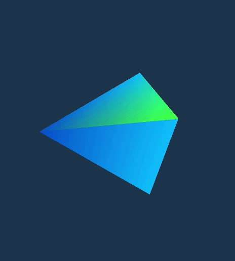

# Lesson 6 - Interactive 3D camera

In the previous lesson, we went from a flat 2D world to a 3D one by constructing and displaying a pyramid. That is really great, because we learned the core concepts of what is needed to "survive" in a world of 3D rendering.

But in this lesson, we will learn how to navigate this 3D world. By navigating, I mean we have to understand how to interact with by changing the camera viewing angles and positions. So the goal of this lesson is simple: learn the concepts needed to controll the camera in order to truly feel the 3D world.

In this lesson we will learn:

- reading mouse button, mouse movement, and keyboard modifier input using GLFW
- tracking mouse movement using the change in X and Y coordinates
- controlling camera yaw and pitch using mouse movement
- rotating the camera around its local up and right axes
- rolling the camera around its local forward axis
- changing the camera's distance from the object using mouse scroll input
- representing and combining camera rotations using quaternions
- using the camera orientation to orbit around our 3D object
- constructing the view matrix from the camera's position and orientation

At the end of this lesson we will be able to control our camera and view our pyramid from all angles like this:



# Contents

0. [Project Structure](#0-project-structure)
1. [Input Handling](#1-input-handling)
2. [Mouse Movement Tracking](#2-mouse-movement-tracking)
3. [Yaw and Pitch](#3-yaw-and-pitch)
4. [Local Camera Axes](#4-local-camera-axes)
5. [Camera Roll](#5-camera-roll)
6. [Camera Zoom](#5-camera-zoom)
7. [Quaternion Rotations](#6-quaternion-rotations)
8. [Orbit Camera](#7-orbit-camera)
9. [View Matrix](#8-view-matrix)


# 0. Project Structure

Before moving any forward I want to say that starting from this lesson, we will not contain all of our code in a single `main.cpp` file. From now on, everything we write, we try to separate into files. I wanted to do the same for lesson 5 already, but at the same time that lesson already had a lot of new and often complex topics to learn, so introducing file tree was not an option (though, to be honest, I feel like if I separated that lesson into different files, maybe t would have been easier to understand).

From now on, we have this structure:

```
lesson_name/
|
|
--- include/    (contains all .hpp (header) files)
|
|
--- src/        (contains all .cpp (source) files)
```

This way, we keep separate application (the whole lesson code) parts in different files which will make the project (lesson code) easier to read and understand.

Another thing to mention, that starting from this lesson, I am not going to talk about every single piece of code section. If I did that, every single leesson's readme would take thousands of lines of explanations. The goal for each lesson moving forward is just to cover main ideas that lesson is about.


## 0.1. Files


# 1. Input handling

Before controlling camera we first have to learn how to read input from keyboard and mouse. Do not think about keyboard and mouse for controlling camera only, because with these input devices we can actually control a lot more than you think, for example:

- text input
- tracking which buttons are being pressed
- mouse movement
- scrolling

Great for us that GLFW provides us with the ability to read and enter this vital part that is crucial for an interactive graphical or game engine.

## 1.1. Input Reading 

Notice, that in the previous sentence, I said that "GLFW provides" and not "OpenGL" provides. Do not stumble on this misinterpretation as I once was doing. Input reading has nothing to do with OpenGL. To repeat myself from the first lesson, OpenGL is a graphics library or graphics API, while GLFW is a graphics library framework, designed for handling the window itself. You can think that OpenGL does not understand what a window is, or in, in other way, you can think that it is "blind" towards the window concept.

Since GLFW is the one responsble for the window, it is also responsible for catching the keyboard and mouse events that happen while the window is in active state.

